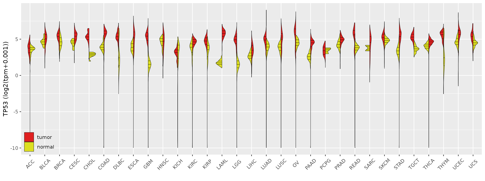
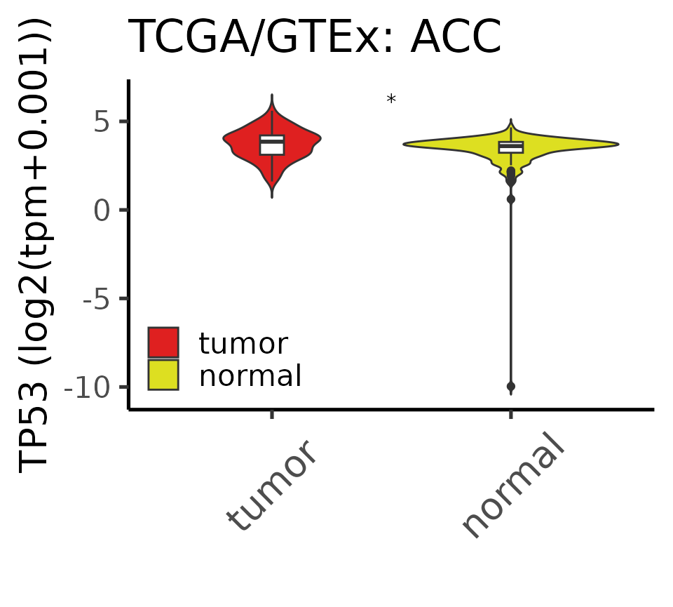
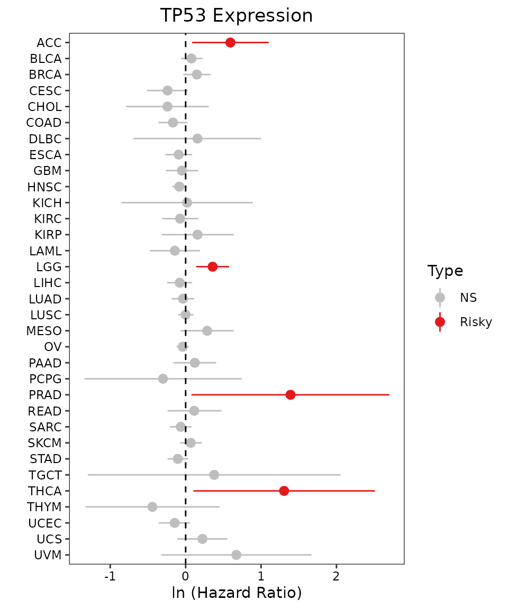

# Examples of Accessible Functions

Firstly, assume you have already installed **UCSCXenaShiny** package.

``` r
library(UCSCXenaShiny)
#> =========================================================================================
#> UCSCXenaShiny version 2.2.0
#> Project URL: https://github.com/openbiox/UCSCXenaShiny
#> Usages: https://openbiox.github.io/UCSCXenaShiny/
#> 
#> If you use it in published research, please cite:
#>   Shensuo Li, Yuzhong Peng, Minjun Chen, Yankun Zhao, Yi Xiong, Jianfeng Li, Peng Luo, 
#>   Haitao Wang, Fei Zhao, Qi Zhao, Yanru Cui, Sujun Chen, Jian-Guo Zhou, Shixiang Wang,  
#>   Facilitating integrative and personalized oncology omics analysis with UCSCXenaShiny, 
#>   Communications Biology, 1200 (2024),  https://doi.org/10.1038/s42003-024-06891-2
#> =========================================================================================
#>                               --Enjoy it--
```

## Tutorial Book

From UCSCXenaShiny v2, we provide a comprehensive [tutorial
book](https://lishensuo.github.io/UCSCXenaShiny_Book/) for introducing
how to use the datasets, functions, and the Shiny application.

## Fetch Data

We provide function to retrieve multi-dimensional data including
genomic, epigenomic, transcriptomic, and proteomic data from TCGA (note,
this actually contains data from TCGA/TARGET/GTEx databases) and CCLE
Pan-Cancer dataset for single identifier (e.g., gene, protein).

Check parameters:

``` r
args(query_pancan_value)
#> function (molecule, data_type = c("mRNA", "transcript", "protein", 
#>     "mutation", "cnv", "methylation", "miRNA", "fusion", "promoter", 
#>     "APOBEC"), database = c("toil", "ccle", "pcawg"), reset_id = NULL, 
#>     opt_pancan = .opt_pancan) 
#> NULL
```

For TCGA gene expression data, we use Xena dataset with ID
`TcgaTargetGtex_rsem_gene_tpm` which includes 19131 samples with tumor
tissue samples and normal tissue samples. The expression value unit is
`log2(tpm+0.001)`.

Let’s check several examples.

### Fetch Gene Expression

``` r
gene_expr <- query_pancan_value("TP53")
#> =========================================================================================
#> UCSCXenaTools version 1.7.0
#> Project URL: https://github.com/ropensci/UCSCXenaTools
#> Usages: https://cran.r-project.org/web/packages/UCSCXenaTools/vignettes/USCSXenaTools.html
#> 
#> If you use it in published research, please cite:
#> Wang et al., (2019). The UCSCXenaTools R package: a toolkit for accessing genomics data
#>   from UCSC Xena platform, from cancer multi-omics to single-cell RNA-seq.
#>   Journal of Open Source Software, 4(40), 1627, https://doi.org/10.21105/joss.01627
#> =========================================================================================
#>                               --Enjoy it--
#> Try querying data #1
#> -> Checking if the dataset has probeMap...
#> -> Done. ProbeMap is found.
#> Saving data to file /tmp/RtmpwTtblX/UCSCXenaShiny/4822f991b17cbdab3831c455be7620b2.rds
#> More info about dataset please run following commands:
#>   library(UCSCXenaTools)
#>   XenaGenerate(subset = XenaDatasets == "TcgaTargetGtex_rsem_gene_tpm") %>% XenaBrowse()
```

``` r
str(gene_expr)
#> List of 2
#>  $ expression: Named num [1:19131] 4.79 5.89 5.52 4.43 2.38 ...
#>   ..- attr(*, "names")= chr [1:19131] "GTEX-S4Q7-0003-SM-3NM8M" "TCGA-19-1787-01" "TCGA-S9-A7J2-01" "GTEX-QV31-1626-SM-2S1QC" ...
#>   ..- attr(*, "label")= chr "gene expression RNAseq"
#>  $ unit      : chr "log2(tpm+0.001)"
```

### Fetch Transcript Expression

``` r
transcript_expr <- query_pancan_value("ENST00000000233", data_type = "transcript")
```

### Fetch Gene CNV

``` r
gene_cnv <- query_pancan_value("TP53", data_type = "cnv")
```

### Fetch Gene Mutation

``` r
gene_mut <- query_pancan_value("TP53", data_type = "mutation")
```

### Fetch miRNA mature strand expression

``` r
miRNA_expr <- query_pancan_value("hsa-let-7a-2-3p", data_type = "miRNA")
```

## Data Visualization

### Visualize Single Gene Expression in PANCAN Dataset

``` r
vis_toil_TvsN(Gene = "TP53", Mode = "Violinplot", Show.P.value = FALSE, Show.P.label = FALSE)
#> Reading cache data /tmp/RtmpwTtblX/UCSCXenaShiny/4822f991b17cbdab3831c455be7620b2.rds
#> More info about dataset please run following commands:
#>   library(UCSCXenaTools)
#>   XenaGenerate(subset = XenaDatasets == "TcgaTargetGtex_rsem_gene_tpm") %>% XenaBrowse()
#> Warning: `aes_string()` was deprecated in ggplot2 3.0.0.
#> ℹ Please use tidy evaluation idioms with `aes()`.
#> ℹ See also `vignette("ggplot2-in-packages")` for more information.
#> ℹ The deprecated feature was likely used in the UCSCXenaShiny package.
#>   Please report the issue at
#>   <https://github.com/openbiox/UCSCXenaShiny/issues>.
#> This warning is displayed once per session.
#> Call `lifecycle::last_lifecycle_warnings()` to see where this warning was
#> generated.
#> Warning: Using `size` aesthetic for lines was deprecated in ggplot2 3.4.0.
#> ℹ Please use `linewidth` instead.
#> ℹ The deprecated feature was likely used in the UCSCXenaShiny package.
#>   Please report the issue at
#>   <https://github.com/openbiox/UCSCXenaShiny/issues>.
#> This warning is displayed once per session.
#> Call `lifecycle::last_lifecycle_warnings()` to see where this warning was
#> generated.
```



### Compare Gene Expression Level in Single Cancer Type

``` r
vis_toil_TvsN_cancer(
  Gene = "TP53",
  Mode = "Violinplot",
  Show.P.value = TRUE,
  Show.P.label = TRUE,
  Method = "wilcox.test",
  values = c("#DF2020", "#DDDF21"),
  TCGA.only = FALSE,
  Cancer = "ACC"
)
#> Reading cache data /tmp/RtmpwTtblX/UCSCXenaShiny/4822f991b17cbdab3831c455be7620b2.rds
#> More info about dataset please run following commands:
#>   library(UCSCXenaTools)
#>   XenaGenerate(subset = XenaDatasets == "TcgaTargetGtex_rsem_gene_tpm") %>% XenaBrowse()
#> Counting P value
#> Counting P value finished
```



### Compare Gene Expression Level in Different Anatomic Regions

This function needs
[gganatogram](https://github.com/jespermaag/gganatogram) package, which
is not on CRAN. Please install it before using this function.

    if (require("gganatogram")) {
      vis_pancan_anatomy(Gene = "TP53", Gender = c("Female", "Male"), option = "D")
    }

[Click to see the
output](https://gitee.com/ShixiangWang/ImageCollection/raw/master/png/20210322130516.png)

### Visualize Relationship between Gene Expression and Prognosis in the PANCAN Dataset

``` r
vis_unicox_tree(
  Gene = "TP53",
  measure = "OS",
  values = c("grey", "#E31A1C", "#377DB8")
)
#> Reading cache data /tmp/RtmpwTtblX/UCSCXenaShiny/4822f991b17cbdab3831c455be7620b2.rds
#> More info about dataset please run following commands:
#>   library(UCSCXenaTools)
#>   XenaGenerate(subset = XenaDatasets == "TcgaTargetGtex_rsem_gene_tpm") %>% XenaBrowse()
#> Get data value for TP53
```



### Other Functions and Data

All exported data and functions are organized at
[here](https://openbiox.github.io/UCSCXenaShiny/reference/index.html).
