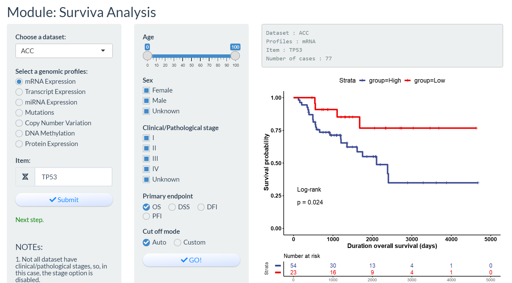

### Survival analysis

1. when you choose to explore the transcipt  and miRNA expression, you need iuput the **Ensenble ID** and **miRNA ID** which similar to **ENSG00000141510** and **hsa-miR-128-3p**.

2. The define and data of four major clinical outcome endpoints form ***doi: 10.1016/j.cell.2018.02.052***.

3. when you chose **Auto** for **cut off mode**, the function of **surv_cutpoint {survminer}** will been called.

   > Determine the optimal cutpoint for one or multiple continuous variables at once, using the maximally selected rank statistics from the 'maxstat' R package. This is an outcome-oriented methods providing a value of a cutpoint that correspond to the most significant relation with outcome (here, survival).

