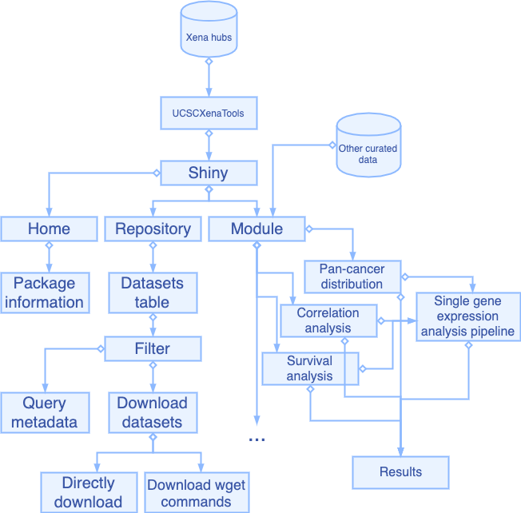
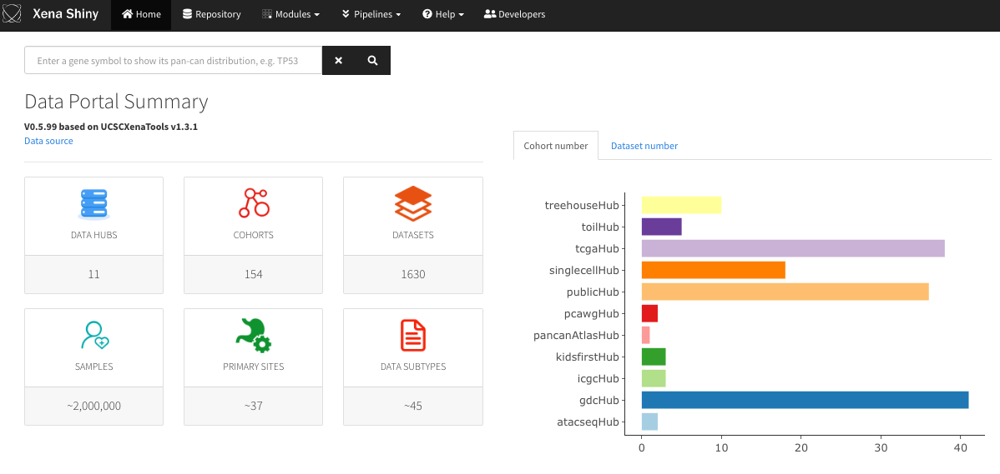
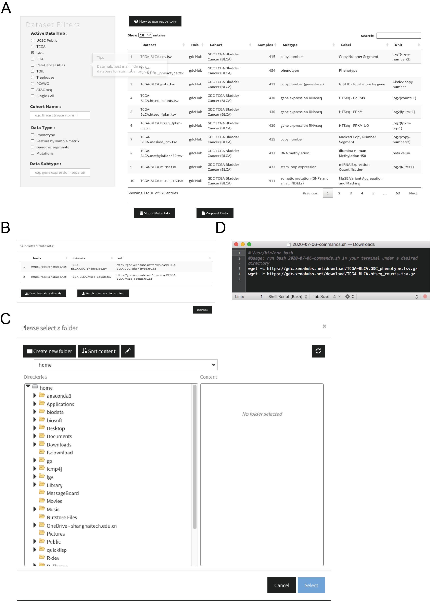

```{r setup, include=FALSE}
knitr::opts_chunk$set(echo = FALSE, warning = FALSE, message = FALSE) # By default, hide code; set to TRUE to see code
knitr::opts_chunk$set(fig.pos = 'h') # 'p' for Places figures on their own pages
knitr::opts_chunk$set(out.width = '100%', dpi=300) # Figure resolution and size
knitr::opts_chunk$set(fig.env="figure") # Latex figure environment

# Hold the figure position 
knitr::knit_hooks$set(plot = function(x, options)  {
  knitr::hook_plot_tex(x, options)
})

library(xtable) # Creates tables that follow OUP guidelines; other options, such as kable, may also be workable

read_markdown <- function(file, trim_ws = TRUE, ...){
    if (length(file) > 1) {
        lines <- file
    } else {
        lines <- readr::read_lines(file)
    }
    lines <- lines[!grepl('^[[:blank:]+-=:_|]*$', lines)]
    lines <- gsub('(^\\s*?\\|)|(\\|\\s*?$)', '', lines)
    readr::read_delim(paste(lines, collapse = '\n'), delim = '|', 
                      trim_ws = trim_ws, ...)
}
```

# Introduction

Over the past decade, programs including TCGA [@weinstein2013cancer], ICGC [@zhang2011international], PCAWG [@the2020pan], GTEx [@gtex2015genotype], CCLE [@barretina2012cancer] and etc. have generated large amounts of molecular data characterizing the landscape of more than ten thousands of tumors from genomic, epigenetic and proteomic aspects. The data have been preprocessed and stored at data hubs of UCSC Xena platform along with many public cancer datasets from individual research groups, providing unprecedented opportunities for either simple or systematic exploration of cancer behaviors and mechanisms at multiple molecular layers in individual caner type or across cancer types [@goldman2019ucsc].

In 2019, we developed UCSCXenaTools, an open-source R package for retrieving and assembling public UCSC Xena data [@wang2019ucscxenatools]. UCSCXenaTools was developed to communicate with UCSC Xena data hubs for downloading datasets or dataset subsets, querying metadata of data hub, cohort or dataset. Despite UCSC Xena platform itself allows users to explore and analyze data, it is hard for researchers to quickly explore all available datasets, locate what they need in their research and download useful datasets. Besides, the analysis features provided by UCSC Xena platform mainly focus on individual cohort data, thus lack of full-feature functionality.

To this end, we develop an open-source R Shiny package UCSCXenaShiny for cancer community to allow researchers to explore and analyze datasets from UCSC Xena data hubs in web browser. In addiction, an extensible module based analysis framework is constructed to analyze data. Currently, several modules providing single-gene expression analysis and visualization are implemented.

# Materials and methods

## Dataset exploration

UCSCXenaShiny opens a web page in user's browser to provide service. The page "Repository" is used to explore all available UCSC Xena datasets. Users can find desired datasets by either defined buttons or searching in dataset table. Once one or several datasets selected, users can query their metadata or download them (Fig.\ref{fig:fig1} and Fig.\ref{fig:fig3}). To improve the performance of downloading large datasets, we provide a button to download a Shell script containing 'wget' commands which can run in Unix-like system.

## Module and pipeline

For now, several modules targeting at single-gene expression analysis are available at page "Module" (Fig.\ref{fig:fig2} and Fig.\ref{fig:fig4}), a pipeline based on them is available at page "Pipeline" (Fig.\ref{fig:fig2}). The usage is quite easy, users just need to type the gene symbol name and all procedures will be properly done by UCSCXenaShiny, including downloading data from UCSC Xena data hubs, cleaning data, analyzing data and visualizing the result. We are happy to accept new feature requests and they can be discussed at <https://github.com/openbiox/UCSCXenaShiny/issues>.

# Results

```{r, echo=FALSE, message=FALSE, warning=FALSE}
library(dplyr)
df = read_markdown("table.txt") %>% 
  dplyr::mutate(
    Cohorts = as.integer(Cohorts),
    Datasets = as.integer(Datasets)
  )
```

## Package structure

The structure and workflow of UCSCXenaShiny is described in Fig.\ref{fig:fig1}. Currently, the core components of this package are page "Repository" and page "Module". Page "Repository" allows researchers to explore and download datasets. Table \ref{tab:tab1} summaries the cohort and dataset number available at different UCSC Xena data hubs. There are total `r sum(df$Datasets)` datasets and TCGA project is the major contributor. The development of UCSCXenaShiny is based on R Shiny platform (<https://shiny.rstudio.com/>), the overview of its graphic interface is shown in Fig.\ref{fig:fig2}.

```{r fig1, fig.cap="Package architecture and functional flowchart of UCSCXenaShiny.", echo = FALSE}

```

```{r fig2, fig.cap="UCSCXenaShiny graphical interface overview.", echo = FALSE, fig.show="hold"}

```

```{r tab1, results="asis", echo=FALSE, message=FALSE, warning=FALSE}
print(xtable(df,caption="Summary of UCSC Xena data hubs.",label="tab:tab1"),
      comment=FALSE)
```

## Feature 1: dataset exploration and download

UCSCXenaShiny allows users to explore UCSC Xena datasets quickly and easily (Fig.\ref{fig:fig3}). A table storing all datasets is shown in Fig.\ref{fig:fig3}A, users can filter datasets by either typing some key words in search bar or selecting data hubs or data types. Once desired datasets are selected in the table, users can click the button on the bottom to check metadata of datasets or download datasets (Fig.\ref{fig:fig3}B-D).

```{r fig3, fig.cap="Dataset search and download.", echo = FALSE, fig.show="hold"}

```

## Feature 2: Single-gene expression analysis

UCSCXenaShiny provides modules implementing basic analysis functionality and modules can be go further assembled as analysis pipeline (Fig.\ref{fig:fig1}). For example, we constructed a few modules to analyze and visualize the single gene expression, including its pan-cancer distribution with violin plot or anatomy heatmap [@gganatogram], and survival effects [@survival-book] under different expression cutoff. We combined some of them and built single-gene expression analysis pipeline so researchers can get as much information as possible in one click for a same task view. An example for gene *TP53* is given in Fig.\ref{fig:fig4}. 

```{r fig4, fig.cap="Current available analysis modules provided UCSCXenaShiny.", echo = FALSE, fig.show="hold"}
knitr::include_graphics("figure4.png")
```

# References
