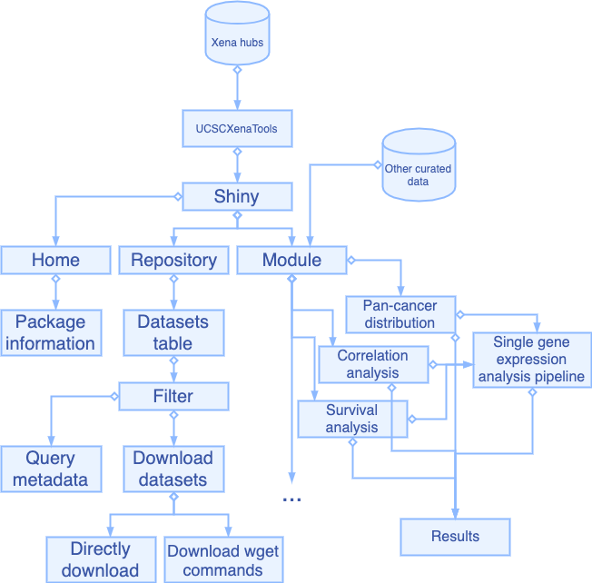

```{r setup, include=FALSE}
knitr::opts_chunk$set(echo = FALSE) # By default, hide code; set to TRUE to see code
knitr::opts_chunk$set(fig.pos = 'p') # Places figures on their own pages
knitr::opts_chunk$set(out.width = '100%', dpi=300) # Figure resolution and size
knitr::opts_chunk$set(fig.env="figure") # Latex figure environment

library(xtable) # Creates tables that follow OUP guidelines; other options, such as kable, may also be workable

read_markdown <- function(file, trim_ws = TRUE, ...){
    if (length(file) > 1) {
        lines <- file
    } else {
        lines <- readr::read_lines(file)
    }
    lines <- lines[!grepl('^[[:blank:]+-=:_|]*$', lines)]
    lines <- gsub('(^\\s*?\\|)|(\\|\\s*?$)', '', lines)
    readr::read_delim(paste(lines, collapse = '\n'), delim = '|', 
                      trim_ws = trim_ws, ...)
}
```

# Introduction

Over the past decade, programs including TCGA, ICGC, PCAWG, GTEx, CCLE and etc. have generated large amounts of molecular data characterizing the landscape of more than ten thousands of tumors from genomic, epigenomic and proteomic aspects. The data have been preprocessed and stored at data hubs of UCSC Xena platform along with many public cancer datasets from individual research groups, providing unprecedented opportunities for eithor simple or systematic exploration of cancer behaviors and mechanisms at multiple molecular layers in individual caner type or across cancer types.

In 2019, we developed UCSCXenaTools, an open-source R package for retrieving and assembling public UCSC Xena data. UCSCXenaTools was developed to communicate with UCSC Xena data hubs for downloading datasets or dataset subsets, querying metadata of data hub, cohort or dataset. Despite UCSC Xena platform itself allows users to explore and analyze data, it is hard for researchers to quickly explore all available datasets, locate what they need in their research and download useful datasets. Besides, the analysis features provided by UCSC Xena platform mainly focus on individual cohort data, thus lack of full-feature functionality.

To this end, we develop an open-source R Shiny package UCSCXenaShiny for cancer community to allow researchers to explore and analyze datasets from UCSC Xena data hubs in web browser. In addiction, an extensible module based analysis framework is constrcuted to analyze data. Currently, several modules providing single gene expression analysis and visualization are implemented.

**Here are two sample references: @Feynman1963118 [@Dirac1953888]. Bibliography will appear at the end of the document.**

# Materials and methods

## Dataset exploration

## Single gene expression analysis

# Results

The current structure and workflow of UCSCXenaShiny is described in Fig. \ref{fig:fig1}. 

```{r fig1, fig.cap="Package architecture and functional flowchart of UCSCXena Shiny", echo = FALSE}

```

```{r, echo=FALSE, message=FALSE, warning=FALSE}
library(dplyr)
df = read_markdown("table.txt") %>% 
  dplyr::mutate(
    Cohorts = as.integer(Cohorts),
    Datasets = as.integer(Datasets)
  )
```

Table \ref{tab:tab1} summarise the cohort and dataset number available at different UCSC Xena data hubs. There are total `r sum(df$Datasets)` datasets and TCGA project is the major controbutor. These datasets all can be retrieved using UCSCXenaShiny at the "Repository" page.

```{r tab1, results="asis", echo=FALSE, message=FALSE, warning=FALSE}
print(xtable(df,caption="This is the table caption",label="tab:tab1"),
      comment=FALSE)
```


You can cross-reference sections and subsections as follows: Section \ref{materials-and-methods} and Section \ref{a-subsection}.


# References
